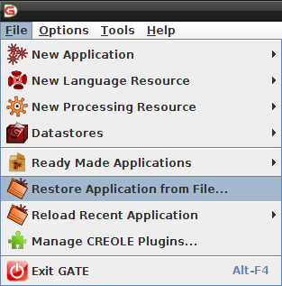
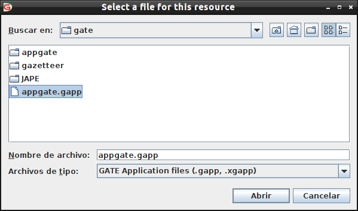
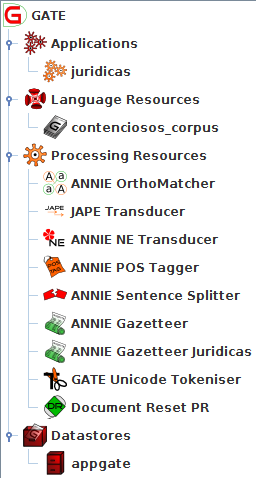
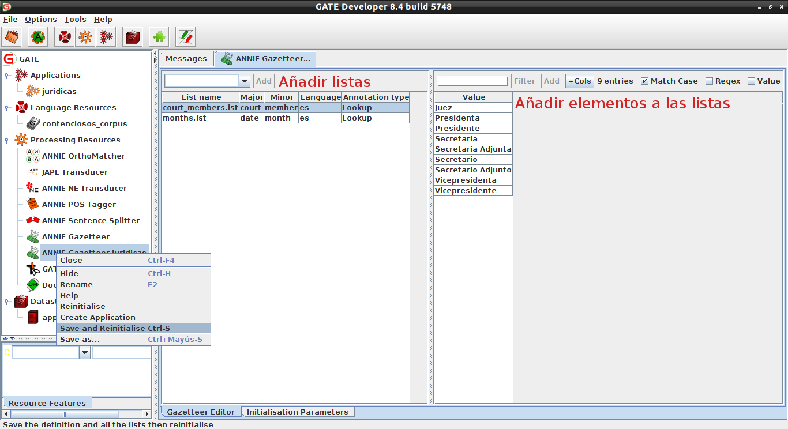
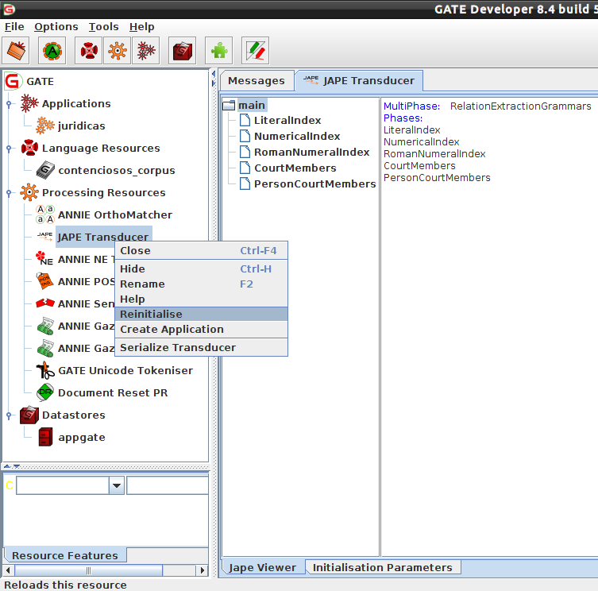
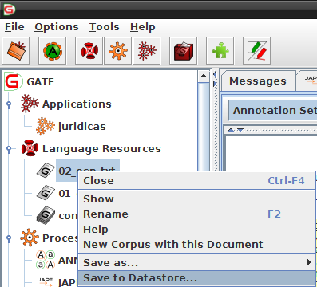
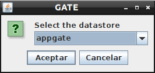
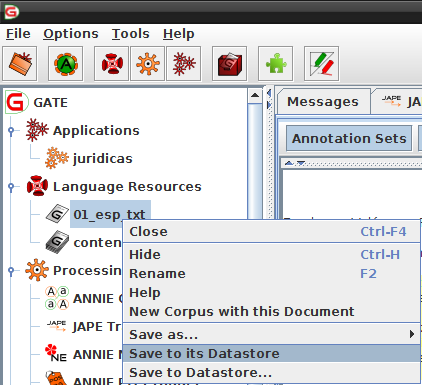
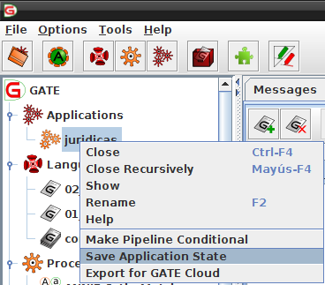
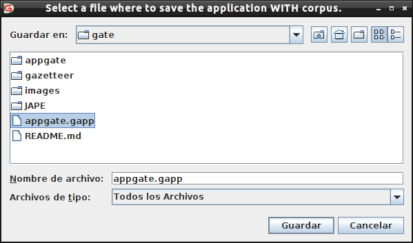

# GATE

## Gate Developer

La aplicación actual ya contiene todos los elementos necesarios para realizar tareas de IE en Gate Developer.

## Notas
- Procurar añadir todos los recursos con codificacion **UTF-8**.
- El **Gazetteer Juridicas** es **case-insensitive**.
- Anotaciones que se muestran en el ejemplo de la aplicación web
    - Actions
    - Articles
    - Case
    - Date2
    - DateSentence
    - PersonCourtMembers
    - ResolutivePoints
    - ConcurrentVote
- Reglas por revisar y/o con dudas
    - CourtMembers
    - Date2
- Reglas por mejorar
    - Articles
    - PersonCourtMembers
    - LastSection
    - ResolutivePointsTemp

### Cargar aplicación

- Abrir **Gate Developer**.
- Ir a **File**.
- Seleccionar **Restore Application from File...**.

  

- Seleccionar el archivo **appgate.gapp**
    - El archivo se encuentra en la ruta **/ruta-al-repo/ConectividadNormativa-/gate**
- Dar click en **abrir**.

  

- Automaticamente se cargaran todos los recursos necesarios de la aplicacón.

  

### Modificar Gazetteer

- Hacer doble click en **Gazetteer Juridicas**.
- Realizar las modificaciones deseadas (añadir listas o añadir elementos a las listas).
- Dar click secundario sobre **Gazetteer Juridicas**
- Seleccionar **Save and Reinitialise**
    - Alternativamente teniendo seleccionado **Gazetteer Juridicas** se puede utilizar el comando **Ctrl-S**

  

### Modificar JAPE Transducer

- Realizar los cambios necesarios en el archivo **main.jape**.
    - El archivo se encuentra en la ruta **/ruta-al-repo/ConectividadNormativa-/gate/JAPE**
- Hacer doble click en **JAPE Transducer**.
- Dar click secundario sobre **JAPE Transducer**
- Seleccionar **Reinitialise**

  

### Guardar cambios en documentos

#### Documentos nuevos

- Dar click secundario sobre el documento.
- Seleccionar **Save to Datastore...**.

  

- Seleccionar el **Datastore** deseado.
- Para este caso solo existe **appgate** pero pueden crear más.

  

#### Documentos existentes

- Dar click secundario sobre el documento.
- Seleccionar **Save to its Datastore...**.

  

### Guardar cambios en corpus

- El proceso es el mismo que con los documentos, pero haciendo click en los corpus con los que se quiera trabajar.

### Guardar la aplicación actual

- Dar click secundario sobre la aplicacion.
- Seleccionar **Save Application State...**.

  

- Seleccionar el archivo **appgate.gapp**
- Dar click en **Guardar**.

  

